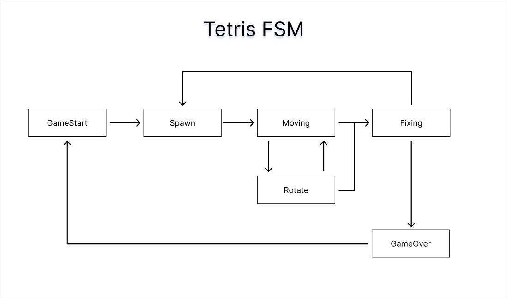
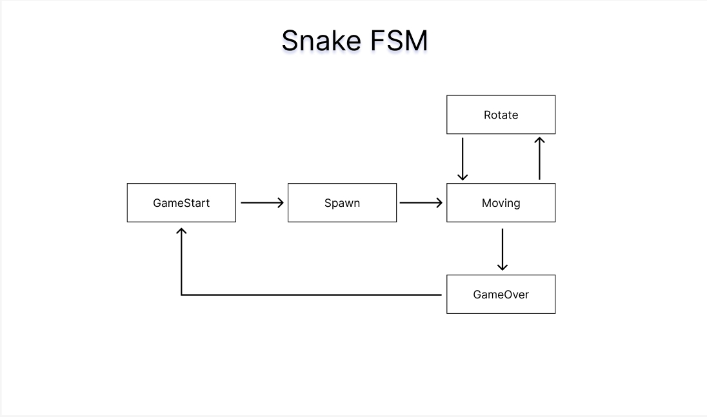
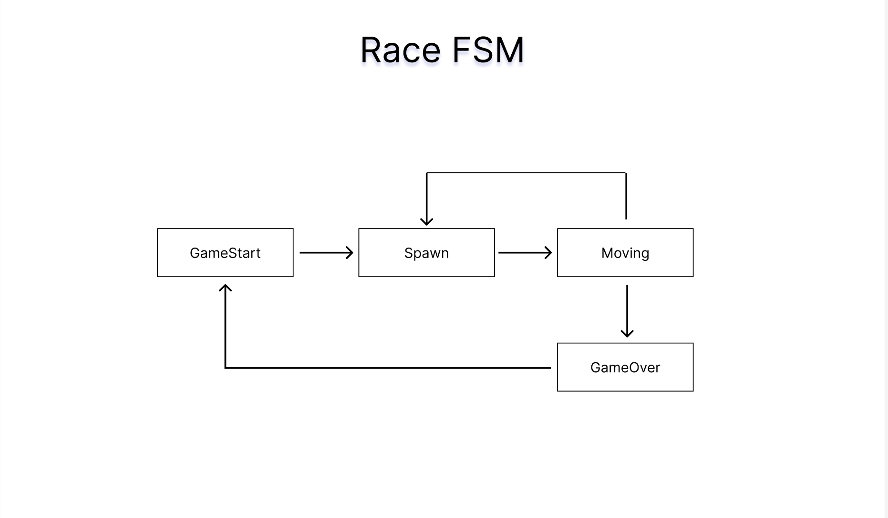

# Документация проекта BrickGame v2.0 aka Tetris & Snake

## Оглавление 
- [Введение](#введение)
- [Архитектура проекта](#архитектура-проекта)
- [Tetris](#tetris)
  - [Управление](#управление)
  - [Модуль GUI](#модуль-gui)
- [Snake](#snake)
  - [Управление](#управление-1)
  - [Модуль GUI](#модуль-gui-1)
- [Race](#race)
  - [Управление](#управление-2)
  - [Модуль Web-GUI](#модуль-web-gui)
- [Сборка и запуск](#сборка-и-запуск)

## Введение 

Этот документ содержит описание проекта BrickGame v3.0 aka Tetris & Snake & Race, включая обзор управления, архитектуры и примеры использования.
## Архитектура проекта

```
.
├── Makefile
├── brick_game
│   ├── bricks.h
│   ├── race
│   │   └── game_logic.py
│   ├── server
│   │   ├── api
│   │   │   └── game_routes.py
│   │   └── app.py
│   ├── snake
│   │   ├── controller_snake.cpp
│   │   ├── controller_snake.h
│   │   ├── model_snake.cpp
│   │   └── model_snake.h
│   ├── tetris
│   │   ├── tetris.c
│   │   └── tetris.h
│   └── web_gui
│       ├── images/
│       ├── index.html
│       ├── main.js
│       ├── race.html
│       ├── race.js
│       ├── readme.md
│       ├── src/
│       └── styles.css
├── doc
│   ├── documentation.md
│   ├── raceFSM.png
│   ├── snakeFSM.jpg
│   └── tetrisFSM.jpg
├── gui
│   ├── cli
│   │   ├── brick_game_cli.py
│   │   ├── bricks_cli.cpp
│   │   ├── bricks_cli.h
│   │   ├── snake_cli.cpp
│   │   ├── snake_cli.h
│   │   ├── tetris_cli.c
│   │   └── tetris_cli.h
│   └── desktop/
└── tests
    └── test_game_logic.py
```

## Tetris

### Управление

- Старт игры: клавиша 'enter'
- Движение фигуры: клавиши 'вниз', 'влево', 'вправо'
- Поворот фигуры: клавиша 'r'
- Пауза: клавиша 'p'
- Выход из игры: клавиша 'q'


### Модуль GUI

Взаимодействие интерфейса происходит с помощью концепции Конечного автомата (КА). Используемый КА для данного проекта:


Конечный автомат состои из модулей:
__GameStart__ - состояние, в котором игра ждет, пока игрок нажмет кнопку готовности к игре

__Spawn__ - состояние, в которое переходит игра при создании очередного блока и выбора следующего блока для спавна.

__Moving__ - основное игровое состояние с обработкой ввода от пользователя

__Rotate__ - поворот блоков/перемещение блоков по горизонтали и ускоренное падение вниз

__Fixing__ - состояние, в которое преходит игра после «соприкосновения» текущего блока с уже упавшими или с землей. Если образуются заполненные линии, то она уничтожается и остальные блоки смещаются вниз. Если блок остановился в самом верхнем ряду, то игра переходит в состояние «игра окончена»

__GameOver__ - игра окончена

## Snake

### Управление

- Старт игры: клавиша 'enter'
- Движение змейки: клавиши 'вниз', 'вврех', 'влево', 'вправо'
- Ускорение змейки: клавиша 'r'
- Пауза: клавиша 'p'
- Выход из игры: клавиша 'q'


### Модуль GUI

Взаимодействие интерфейса происходит с помощью концепции Конечного автомата (КА). Используемый КА для данного проекта:


Конечный автомат состои из модулей:
__GameStart__ - состояние, в котором игра ждет, пока игрок нажмет кнопку готовности к игре

__Spawn__ - состояние, в которое переходит игра при поедании змейкой яблока и генерации нового яблока.

__Moving__ - основное игровое состояние с обработкой ввода от пользователя

__Rotate__ - поворот змейки

__GameOver__ - игра окончена


## Race

### Управление

- Старт игры: клавиша 'пробел'
- Движение машинки: клавиши 'влево' и 'вправо'
- Пауза: клавиша 'p'
- Выход из игры: клавиша 'q'

### Модуль Web-Gui

Взаимодействие интерфейса происходит с помощью концепции Конечного автомата (КА). Используемый КА для данного проекта:


Конечный автомат состоит из следующих состояний:

- **GameStart** - состояние, в котором игра ждет, пока игрок нажмет кнопку начала игры. В это время машинка игрока находится на стартовой позиции.

- **Spawn** - состояние, в котором происходит генерация новых препятствий (врагов) в верхней части игрового поля.

- **Moving** - основное игровое состояние, в котором игрок управляет движением своей машинки. Враги перемещаются вниз по экрану, и игрок должен избегать столкновений.

- **GameOver** - состояние окончания игры. Если произошло столкновение, игра завершается, и игроку предлагается начать новую игру или выйти.

Этот автомат позволяет структурировать игровой процесс, чётко определяя переходы между состояниями и действия игрока в каждом из них.


## Сборка и запуск

Сборка происходит с помощью мейкфала, основные цели: 
- make: компиляция консольной и десктоп версии
- make cli: компиляция консольной версии (Tetris, Snake, Race)
- make desktop: компиляция десктоп версии (Tetris, Snake)
- make web-gui: запуск веб-сервера (для Race)
- make install: компиляция консольной и десктоп версии
- make uninstall: удаление скомпилированной консольной и дескотоп версии
- make dvi: открытие докуменации
- make dist: создает сжатый tar-архив текущей сборки проекта
- make clean: удаление всех файлов, создаваемых в процессе компиляции предыдущих целей
- make tests: запуск юнит-тестов


Для запуска игры, необходимо открыть файл:
- BrickGame_v2_cli для консольной версии
- BrickGame_v2_desktop для десктоп версии
- Открыть в браузере после запуска сервера (make web-gui): http://127.0.0.1:8080


